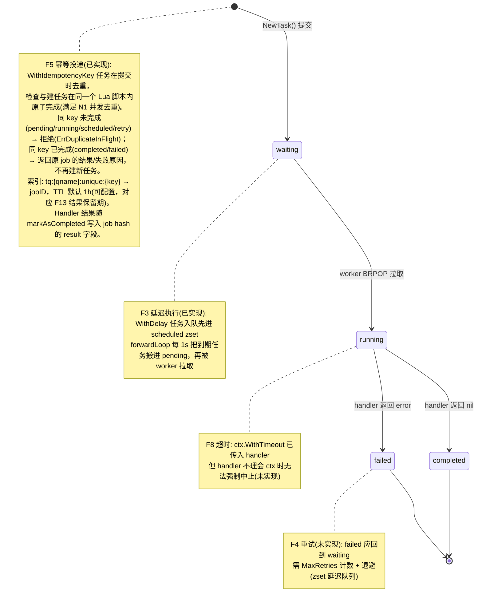
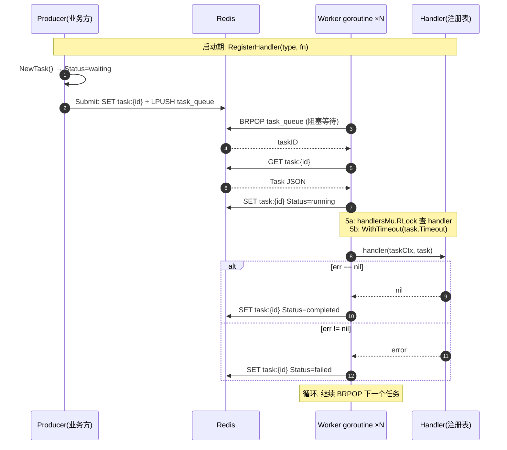

# Task-Queue 核心架构图

## 1. 状态流转（当前实现）

## 2. 组件交互（一次任务的完整旅程）

## 3. 未实现路线（图上虚线部分对应的功能）

| 功能 | 依赖的基础设施 | 图上的位置 |
|------|---------------|-----------|
| F4 重试 | zset 延迟队列 + MaxRetries 计数 | failed → waiting 虚线 |
| F8 超时强制终止 | 超时后强制标 failed | running 状态 |
| F9 故障隔离 | handler panic recover | running 状态 |
| F11 可观测 | metrics 采集 | 全部状态 |
